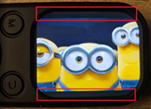

# AVI Video Converter for Portable MP3 Players (P20-Player_D2B)

## Background

I couldn't find `SetupPxConverter(2.0.10).exe`, but I did find  
https://github.com/fdd4s/portable_music_player_avi_video_converter_tool_2025.

I wasn’t happy with mono sound, and later discovered a few limitations. The main ones were:  
- Missing stereo sound  
- Suboptimal audio quality (fdd4s set it to 16k, but it works fine at 22k)  
- First .avi file sometimes wouldn’t play when splitting  
- No aspect ratio fix  
- No support for sound gain  

This script converts videos to AVI format suitable for portable music players using ffmpeg.  
It creates output files named like the source file but with `-p` appended.  
If the video is split, files will be named with `-01`, `-02`, `-03`, ...

These scripts rely on a modified ffmpeg build (`ffmpeg-mod.exe`) that supports extra x264 parameters.  
Standard ffmpeg does not accept those parameters.

> Personally, I don’t trust ffmpeg-mod and always run it in a free version of [Sandboxie software](https://sandboxie-plus.com/) in a "Box/Folder" without internet access.

## Dependencies

- `ffmpeg-mod.exe`  
- These scripts are designed for Windows.

## Supported players
 
Portable music player with a 2.01-inch screen (240×296 resolution) and support for AVI video playback at **288×240 resolution**.

  
AVI format with a custom H.264 video codec.

If your player has a different resolution, feel free to search for `288` and `240` in the scripts and adjust them.  
**TODO (for myself):** Use variables instead of hardcoded values.
(I still don’t know why I didn’t do that in the first place.)

## How to identify your player's format

The `test_video` folder contains a 30-second fragment of the Creative Commons video  
**Big Buck Bunny** – [Wikipedia link](https://en.wikipedia.org/wiki/Big_Buck_Bunny)  
You can use it to test compatibility with your device.

## Usage

    C:\somewhere\> run-split.bat <video file>

For help:  

    C:\somewhere\> run-split.bat -?

### Parameters:

- **input_file**   Path to the input video file (required)

- **-cropadjust**  0–100, how much to adjust the aspect ratio (default: 0)  
  Adds or removes black borders to better match the device’s ideal 6:5 aspect ratio (288×240)

- **-splitmin**   Segment length in minutes (0 = no splitting)  
  Creates separate files: `name-01.avi`, `name-02.avi`, etc.

- **-soundgain**  Audio gain or reduction in `x.x` dB (default: 0.0, negative values also allowed)

## Example

    C:\somewhere\> run-split.bat C:\Cartoons\videofile.mp4 -cropadjust 50 -splitmin 30 -soundgain 5

Example, when changing cropadjust value:

<table border="1">
  <tr>
    <th>cropadjust value</th>
    <th>How it looks in this example</th>
  </tr>
  <tr>
    <td>cropadjust = 0</td>
    <td></td>
  </tr>
  <tr>
    <td>cropadjust = 30</td>
    <td></td>
  </tr>
  <tr>
    <td>cropadjust = 60</td>
    <td></td>
  </tr>
  <tr>
    <td>cropadjust = 100</td>
    <td></td>
  </tr>
</table>

## MP3 players – known limitations:

- Video files can't be fast-forwarded or bookmarked (unlike MP3s)
- Video audio does not play through Bluetooth speakers
- The MP3 player can’t transfer files over Bluetooth, so I have to use a USB-C cable or SD card instead.

## Where to buy these players?

I bought both of my MP3 players (black and white) on AliExpress.

## Project name

Why is the project named **"P20 Player_D2B"**?  
Because when I connected the MP3 player to my computer, that’s the name it showed :)

P20 Player_D2B: [Link to manual](manual/P20-Player_D2B-manual-onlineOCR.pdf)

## Credits

Originally created by [fdd4s](https://github.com/fdd4s/)  
Send feedback and questions to fc1471789@gmail.com  

---

This powershell script and new .bat file created by [tomaz1](https://github.com/tomaz1/)  
Send feedback to okay-aside-late@duck.com

---
All script files are public domain https://unlicense.org/
